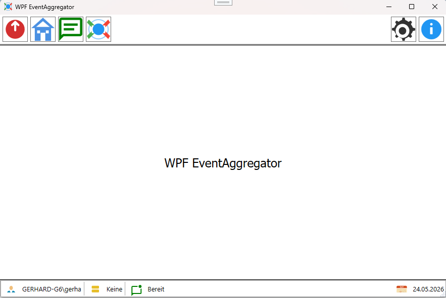
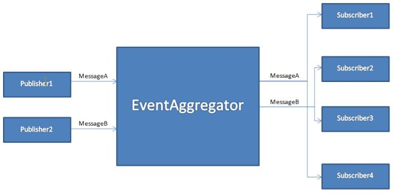
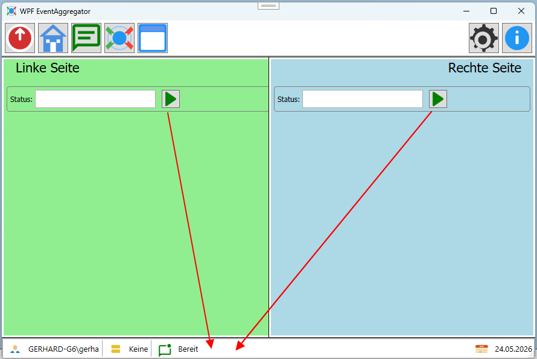
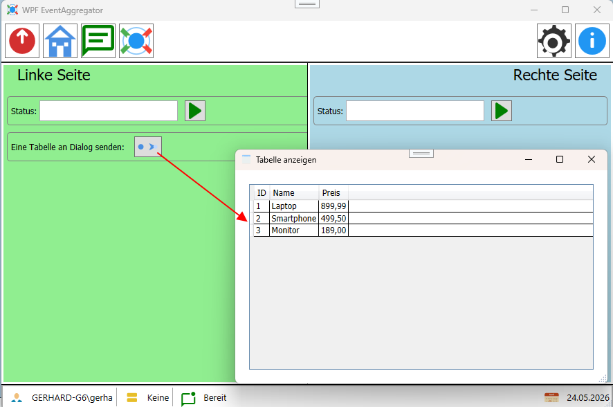

# WPF EventAggregator


# Projekt
Das Beispiel zum **EventAggregator** soll das Zusammenwirken der Kommunikation zwischen Klassen und UserControl in einer WPF Anwendung zeigen.
<br/>

<br/>
Es verwendet das **EventAggregator** Pattern, um die Kommunikation zwischen den Komponenten zu ermöglichen. Es gibt drei Klassen, die das IEventAggregator Interface implementieren: MainWindow, ContentLinksUC und ContentRechtsUC. Jede Klasse kann Nachrichten senden und empfangen, ohne direkt voneinander abhängig zu sein.\
<br/>


````csharp
App.EventAgg.Subscribe<StatusEvent>(async (evt, ct) => this.OnUpdateStatusBar(evt));
````
Der Übergebene Typ z.B. `StatusEvent' in Subscribe gibt an, welche Art von Nachrichten die Klasse empfangen möchte. In diesem Beispiel abonnieren die Klassen auf Nachrichten vom Typ "StatusEvent". Wenn eine Nachricht dieses Typs gesendet wird, wird die Methode "OnUpdateStatusBar" aufgerufen, um die Statusleiste zu aktualisieren.

# Features
Der **EventAggregator** ist zum einen generisch, was bedeutet, dass er mit verschiedenen Nachrichtentypen arbeiten kann, und zum anderen asynchron, was bedeutet, dass die Nachrichtenverarbeitung nicht blockierend ist. Das ermöglicht eine flexible und effiziente Kommunikation zwischen den Komponenten der Anwendung. Die Klassen können Nachrichten senden, ohne sich um die Details der Empfänger kümmern zu müssen, und die Empfänger können Nachrichten empfangen, ohne sich um die Details der Sender kümmern zu müssen. Das fördert eine lose Kopplung und erleichtert die Wartbarkeit und Erweiterbarkeit der Anwendung.
Damit ist diese variante des **EventAggregator** besonders in einem MVVM Umfeld geeignet.

# Möglichkeiten
Über den **EventAggregator** können Nachrichten mit einem bestimmten Typ gesendet werden, und alle Klassen, die diesen Typ abonnieren, erhalten die Nachricht. In diesem Beispiel gibt es zwei Nachrichten: "Nachricht von Links" und "Nachricht von Rechts". Wenn eine Nachricht gesendet wird, wird sie an alle Abonnenten weitergeleitet, die auf diesen Nachrichtentyp hören.

Das Prinzip ist grundsätzlich immer das gleiche, egal ob einfache Typen oder komplexe Objekte als Nachrichten gesendet werden.

## Registrieren von Nachrichten
Bevor eine Klasse Nachrichten empfangen kann, muss sie sich für den entsprechenden Nachrichtentyp für `Subscribe` registrieren. In diesem Beispiel wird in der Klassen `MainWindow` für Nachrichten vom Typ "StatusEvent" registriert.
````csharp
App.EventAgg.Subscribe<StatusEvent>(async (evt, ct) => this.OnUpdateStatusBar(evt));
````

**Hinweis:**
Die `Subscribe`-Methode wird ein Lambda-Ausdruck übergeben, der die Methode `OnUpdateStatusBar` aufruft, wenn eine Nachricht vom Typ "StatusEvent" empfangen wird. In diesem Fall wird die Statusleiste aktualisiert, um den Inhalt der empfangenen Nachricht anzuzeigen.
In der Regel wird die Registrierung von Nachrichten in der Konstruktor oder in einer Initialisierungsmethode der Klasse durchgeführt, in dem sich auch die auszuführende Methode befinden.

## Senden von Nachrichten
Um eine Nachricht zu senden, wird die `Publish`-Methode des **EventAggregator** verwendet. In diesem Beispiel wird eine Nachricht vom Typ "StatusEvent" gesendet, wenn ein Button in einem der UserControls geklickt wird.
````csharp
if (App.EventAgg.IsSubscription<StatusEvent>() == true)
{
    await App.EventAgg.PublishAsync(new StatusEvent(Guid.NewGuid(), this.StatusMessage));
}
````

## Beispiel für einfache Typen als Nachrichten
Von den beiden UserControls ContentLinksUC und ContentRechtsUC gibt es jeweils einen Button, der eine Nachricht sendet, wenn er geklickt wird. Die Nachricht enthält Informationen darüber, von welchem UserControl sie gesendet wurde. Wenn die Nachricht empfangen wird, wird die Statusleiste in MainWindow aktualisiert, um anzuzeigen, welche Nachricht empfangen wurde.


## Beispiel mit komplexe Objekte als Nachrichten
Es ist aber auch möglich, Komplexe Objekte als Nachrichten zu senden, um mehr Informationen zu übermitteln. In diesem Beispiel werden einfache Strings verwendet, aber es könnte auch ein benutzerdefiniertes Objekt mit mehreren Eigenschaften sein.
in dem Beispielwird ein `DataTable` als Nachricht gesendet, um eine Tabelle mit Daten zu übermitteln. Wenn die Nachricht empfangen wird, könnte die Statusleiste aktualisiert werden, um anzuzeigen, dass eine Tabelle empfangen wurde, und die Daten könnten in einer DataGrid oder einem anderen Steuerelement angezeigt werden.



- Migration auf NET 10
- Weiterentwicklung mit neuen Features
- Neues Design und Demoprogramm
